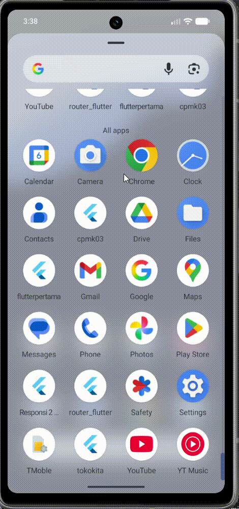

<h1> Responsi 2 Mobile Paket 1 (H1D023073)</h1>
## Nama  : Muhammad Zaim Pahlevi
## NIM   : H1D023073
## Shift : E

## Demo Aplikasi

### Deskripsi Aplikasi

Aplikasi ini adalah aplikasi mobile Flutter bernama "mart" yang digunakan untuk mengelola inventaris produk komputer. Aplikasi ini memiliki fitur autentikasi (login dan registrasi), serta operasi CRUD (Create, Read, Update, Delete) untuk produk.

### Arsitektur Aplikasi

- **Framework**: Flutter (SDK ^3.9.2)
- **State Management**: BLoC (Business Logic Component) untuk mengelola state aplikasi
- **Komunikasi API**: Menggunakan package `http` (^0.13.4) untuk berkomunikasi dengan server backend
- **Penyimpanan Lokal**: Menggunakan `shared_preferences` (^2.0.11) untuk menyimpan token autentikasi dan ID pengguna

### Integrasi API

Aplikasi ini terintegrasi dengan server backend melalui REST API. Semua request ke API memerlukan autentikasi menggunakan token Bearer yang disimpan secara lokal setelah login berhasil. API yang digunakan dibuat menggunakan php dengan framework CodeIgniter 4. adapun dokumentasi API dan spesifikasinya bisa dilihat di link berikut ini: https://github.com/jaimpalepi/responsi-api

**Endpoint API yang digunakan:**

- **Registrasi**: `POST /registrasi` - Mendaftarkan akun baru dengan data nama, email, dan password
- **Login**: `POST /login` - Autentikasi pengguna dan mengembalikan token serta ID pengguna
- **List Produk**: `GET /komputer` - Mengambil daftar semua produk komputer
- **Detail Produk**: `GET /komputer/{id}` - Mengambil detail produk berdasarkan ID
- **Tambah Produk**: `POST /komputer` - Menambah produk baru
- **Update Produk**: `PUT /komputer/{id}` - Mengupdate data produk berdasarkan ID
- **Hapus Produk**: `DELETE /komputer/{id}` - Menghapus produk berdasarkan ID

Setiap request API (kecuali registrasi) menyertakan header `Authorization: Bearer {token}` dan `auth-key: {token}` untuk autentikasi. Jika token tidak valid atau tidak ada, server akan mengembalikan error 401 (Unauthorized).

### Alur Kerja Aplikasi

1. **Inisialisasi Aplikasi**: Saat aplikasi dimulai, `main.dart` memeriksa apakah pengguna sudah login dengan melihat token yang disimpan di shared preferences.
2. **Halaman Login/Registrasi**: Jika belum login, aplikasi menampilkan halaman login (`LoginPage`). Pengguna dapat memasukkan email dan password untuk login, atau navigasi ke halaman registrasi (`RegistrasiPage`) untuk membuat akun baru.
3. **Autentikasi**: Proses login dan registrasi menggunakan BLoC (`LoginBloc` dan `RegistrasiBloc`) yang berkomunikasi dengan API server. Jika berhasil, token dan ID pengguna disimpan secara lokal.
4. **Halaman Produk**: Setelah login berhasil, pengguna diarahkan ke halaman produk (`ProdukPage`) yang menampilkan daftar produk dalam bentuk list.
5. **Operasi Produk**:
   - **Melihat Detail**: Pengguna dapat mengetuk item produk untuk melihat detail (`ProdukDetail`).
   - **Menambah Produk**: Tombol tambah (+) di app bar membuka form untuk menambah produk baru (`ProdukForm`).
   - **Mengedit Produk**: Dari halaman detail, pengguna dapat mengedit produk.
   - **Hapus Produk**: Opsi hapus tersedia di halaman detail.
6. **Logout**: Pengguna dapat logout melalui drawer di halaman produk, yang akan menghapus token dan mengarahkan kembali ke halaman login.

### Fitur Utama

- **Login**: Autentikasi pengguna dengan email dan password
- **Registrasi**: Pendaftaran akun baru dengan nama, email, dan password
- **List Produk**: Menampilkan daftar produk dengan nama dan harga
- **Detail Produk**: Melihat informasi lengkap produk
- **Tambah Produk**: Form untuk menambah produk baru
- **Edit Produk**: Form untuk mengubah data produk
- **Hapus Produk**: Menghapus produk dari inventaris
- **Logout**: Keluar dari akun dan kembali ke login

### Dependencies

- `flutter`: Framework utama
- `http`: Untuk HTTP requests ke API
- `shared_preferences`: Untuk penyimpanan lokal
- `cupertino_icons`: Ikon untuk iOS style
